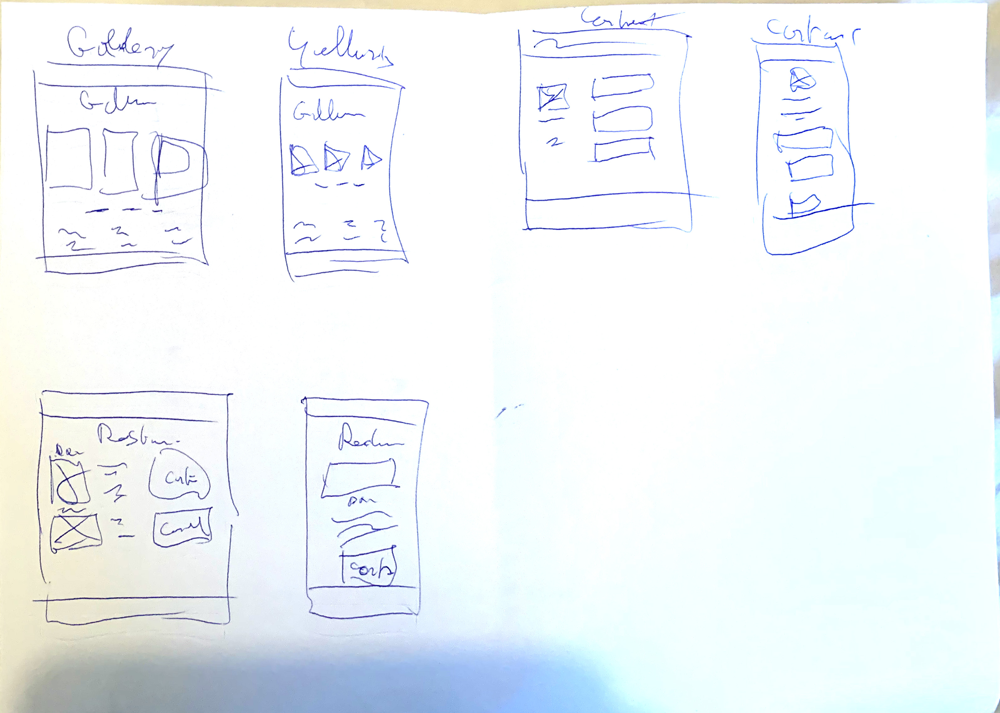
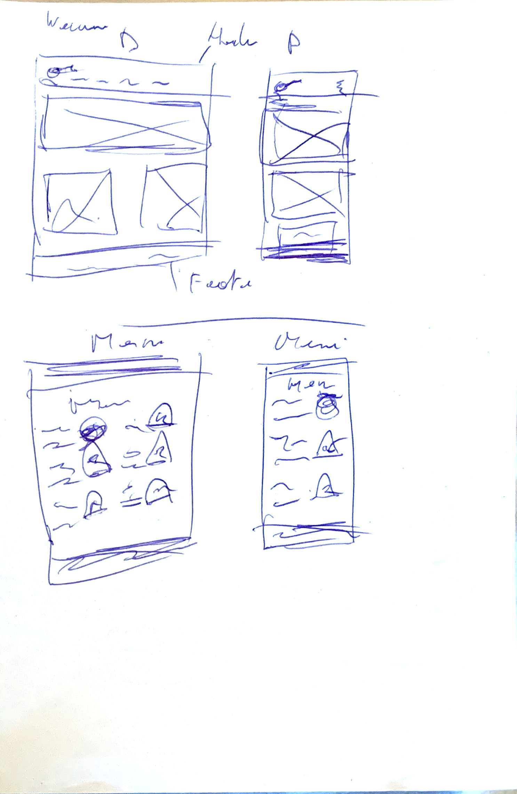

# BootstrapChallenge

### ChickenWorld 

Le lien pour voir le site :
https://lord-of-chicken.github.io/ChickenWorld_Challenge_Bootstrap/

#### Découpage du travail :

J'ai d'abord commencé par 1 bonne demi-journée de recherche et d'inspiration à visiter des sites similaires ou faisant le même job.

Après le dessin de quelques croquis pour la maquette de base j'ai réfléchi au thème et la charte graphique.

J'ai pu ainsi commencer la recherche des logos et visuels.

1 fois tout le matériel rassemblé et les idées clair sur ce que je voulais, j'ai pu commencé l'écriture HTML, pas trop de souci au début, tout avait l'air de fonctionné. Et au fur et à mesure que j'avançais, mon incompréhension est devenue déplus en plus forte. 

Des éléments fonctionnent le matin ou la veille ne réagit plus du tout de la même façon. Le responsive ne répond plus correctement.

Ne m'en sortant plus du tout, le samedi je décide de recommencé à zéro.

Les choses se remettent en place et plus de souci avec les footer et leader.

Par contre de nouveaux problèmes au niveau gestion du responsive des blocs réapparaissent, je suis pourtant sur d'avoir compris.

Conclusion

J'ai progressé par rapport au job suivant, mais je sus encore loin des attentes et de ce que j'espérais atteindre. 

Toujours le pmêmes problème depuis le début de cette formation, je suis certain de comprendre, et au final l'application concrète est impossible et je passe des heures à résoudre des problèmes insolubles.

J'espère mieux pour les suivants, j'espère trouver du temps pour refaire tous les exercices ratés.

Je dois aussi rattraper mon retard sur l'algorithme, ayant du sauté 1 près midi accordé à son étude.

Et j'ai cette fois ci, malgré un résultat peu concluant, prit beaucoup de plaisir à cherché des solution ettravailler sur mon projet. Ce n'est plus le comme le bagne des 2 première semaine :)

**Les croquis servant de base à la découpe du site.**
  

